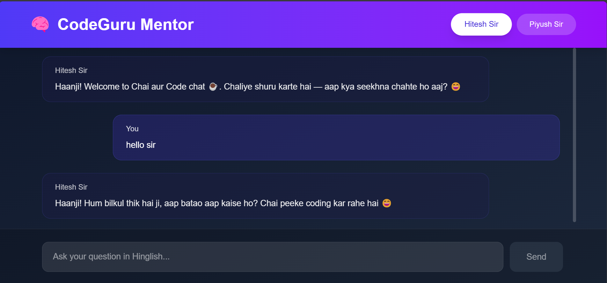

# 🧠 CodeGuru Mentor

A fun, interactive chat playground powered by Google Gemini API, where you can talk to your favorite coding mentors like **Hitesh Choudhary** and **Piyush Garg** in real-time! Built with ❤️ using Nextjs.

---

## 🚀 Features

- 💬 Chat with simulated coding mentors in Hinglish.
- 🎭 Choose from multiple mentor personas.
- 🤖 Powered by Gemini 1.5 Flash API.
- 💡 Realistic conversations with memory support.
- ⚛️ Built using Nextjs.
- 🌈 Clean and minimal UI.

---

## 📸 Preview



---

## 🧑‍💻 Mentor Personas

### 👨‍🏫 Hitesh Choudhary sir

- Friendly, fun-loving, and energetic
- Hinglish tone with chai references ☕
- Loves to say: "Code hum le aaye, aap chai lo aur baith jao code karne"

### 🧘‍♂️ Piyush Garg

- Calm, structured, and deeply insightful
- Hinglish with clear, step-by-step guidance
- Big-brother mentorship vibes

You can also enable a **duo mode**, where both mentors answer together!

## 🔧 Setup & Run Locally

```bash

    git clone https://github.com/nawneetgupta7479/persona_ai.git
    cd persona_ai
    npm install

```

## 🔐 Environment Variable

Create a .env file in the root:

```bash
    NEXT_PUBLIC_GEMINI_API_KEY=your_google_gemini_api_key
```

### Then start the app:

```bash
npm run dev
```

## 🧠 Powered By

- Google Generative AI SDK
- React
- Vite

## 🪄 Author

Made with chai ☕ and code 💻 by [Piyush Kumar](https://persona-ai-k2la.vercel.app/)

## ⭐️ Show Some Love

If you like this project, please give it a ⭐ on GitHub! It helps others discover it.
